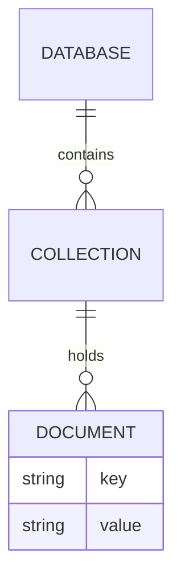
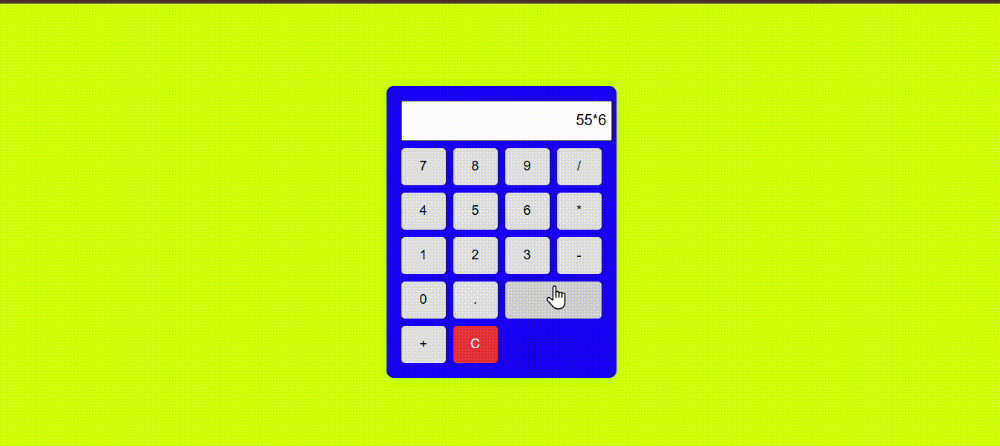
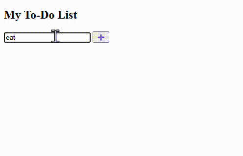

# 📘 JavaScript, jQuery & MongoDB Notes  

This README contains quick reference notes on **JavaScript fundamentals**, **Closures**, **Callbacks**, **jQuery**, and **MongoDB**.  

---

## 📑 Table of Contents  
- [🚀 JavaScript Overview](#-javascript-overview)  
  - [Array Methods](#-array-methods)  
  - [Variables](#-variables)  
  - [Data Types](#-data-types)  
  - [DOM Methods](#-dom-methods)  
- [🌀 Closures](#-closures)  
- [🔄 Callbacks](#-callbacks)  
- [💡 jQuery](#-jquery)  
- [🍃 MongoDB](#-mongodb)  
  - [MongoDB Hierarchy](#-mongodb-hierarchy)  
  - [Basic Commands](#-basic-commands)
- [sample projects](#-Sample-projects)
- [📅 Timeline](#-timeline)


---

## 🚀 JavaScript Overview  
JavaScript is a **high-level, interpreted, object-oriented programming language**.  

### 🔹 Array Methods  
1. **`map()`** → Creates a new array by applying a function to each element.  
2. **`filter()`** → Filters elements of an array based on a condition.  
3. **`reduce()`** → Reduces an array to a single value based on a function.  

```js
// Example
let nums = [1, 2, 3, 4];

// map
let doubled = nums.map(x => x * 2); // [2, 4, 6, 8]

// filter
let evens = nums.filter(x => x % 2 === 0); // [2, 4]

// reduce
let sum = nums.reduce((acc, x) => acc + x, 0); // 10
```

| Keyword | Scope           | Reassign | Redeclare |
| ------- | --------------- | -------- | --------- |
| `let`   | Block-scoped    | ✅ Yes    | ❌ No      |
| `var`   | Function-scoped | ✅ Yes    | ✅ Yes     |
| `const` | Block-scoped    | ❌ No     | ❌ No      |

# 🔹 Data Types

- Primitive → string, number, boolean, null, undefined, symbol, bigint

- Non-Primitive → object, array, function

#DOM Methods

```js
document.getElementById("id");
document.getElementsByClassName("class");
document.getElementsByTagName("tag");
document.querySelector("selector");
```

# 🌀 Closures

A closure is created when a function remembers variables from the scope where it was created, even after that scope has finished executing.

```js
function outer() {
  let count = 0;
  return function inner() {
    count++;
    return count;
  }
}
const counter = outer();
console.log(counter()); // 1
console.log(counter()); // 2
```
# 🔄 Callbacks

Callbacks let you pass functions as arguments, enabling dynamic execution.

## ✅ Common Uses:

- Event handling

- Asynchronous operations (API calls, timers, file reading)

- Functional programming

```js
function greet(name, callback) {
  console.log("Hello " + name);
  callback();
}
greet("Aravind", () => console.log("Welcome!"));
```
## 💡 jQuery

jQuery is a lightweight “write less, do more” JavaScript library.

# ✨ Features

- HTML/DOM manipulation

- CSS manipulation

- Event handling

- Effects & animations

- AJAX

- Utilities

```js
// Run code after page load
$(document).ready(function(){
  $("button").click(function(){
    alert("Button Clicked!");
  });
});
```
## 🍃 MongoDB

MongoDB is a document-based database that stores data as key-value pairs in JSON format.

Database → like a container

Collection → like a table

Document → like a row (stored as objects)

Horizontal scalability supported 🚀


# 🔹 Basic Commands
```bash
# Start MongoDB
mongosh

# Create & use a database
use myDatabase

# Show databases
show dbs

# Create collection
db.createCollection("users")

# Insert data
db.users.insertOne({name: "Aravind", age: 22})
db.users.insertMany([{name: "John"}, {name: "Doe"}])

# Show collections
show collections

# Find documents
db.users.find()

# Update
db.users.updateOne({name: "John"}, {$set: {age: 30}})
db.users.updateMany({}, {$set: {active: true}})

# Delete
db.users.deleteOne({name: "Doe"})
db.users.deleteMany({active: false})
```
## ⚠ Note: In MongoDB, a database or collection is not created until it gets content.

# Sample-projects
### 🔢 Calculator (DOM Manipulation in JavaScript)  
A simple calculator built using **JavaScript DOM manipulation**.  
- Performs basic arithmetic operations: ➕ ➖ ✖ ➗  
- Interactive UI using buttons and a display area  
- Great example of handling **events & updating the DOM** dynamically

  


  ### To-do list:
  A minimal To-Do List app made with jQuery.

  - Add, remove, and mark tasks as complete

   - Demonstrates event handling and DOM manipulation with jQuery

     



## 📅 Timeline

📌 02-09-2025 to 03-09-2025 → JavaScript, Closures, Callbacks, jQuery

📌 04-09-2025 → MongoDB,Express


